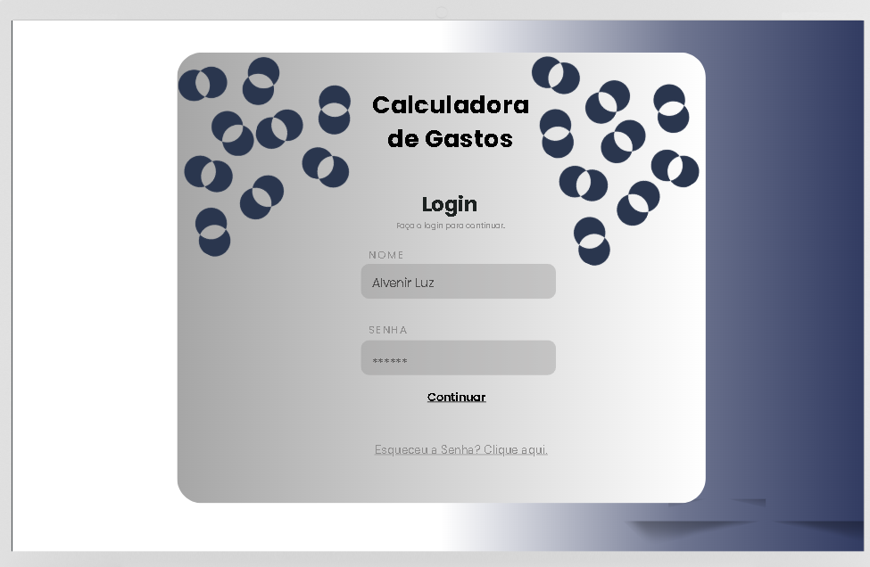
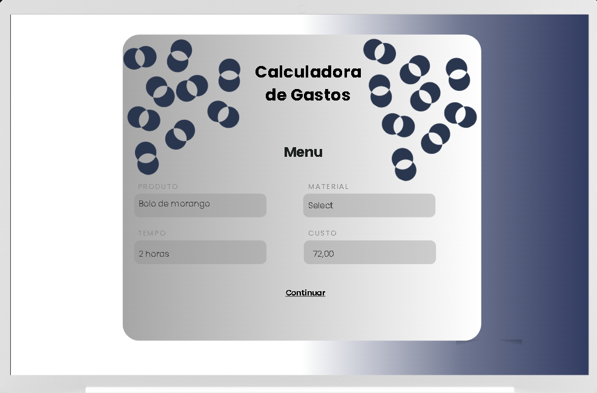
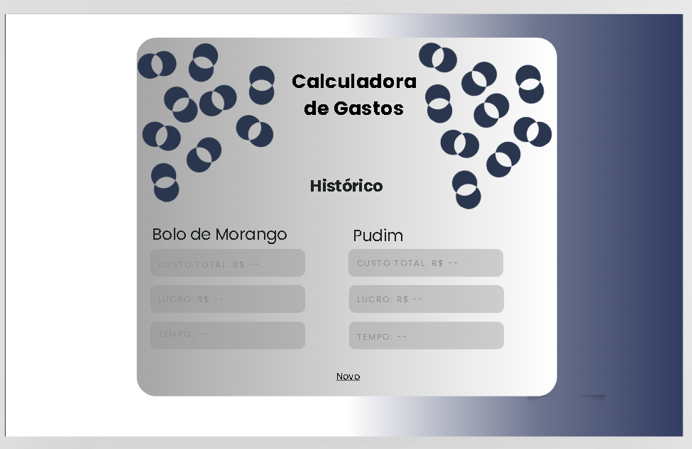
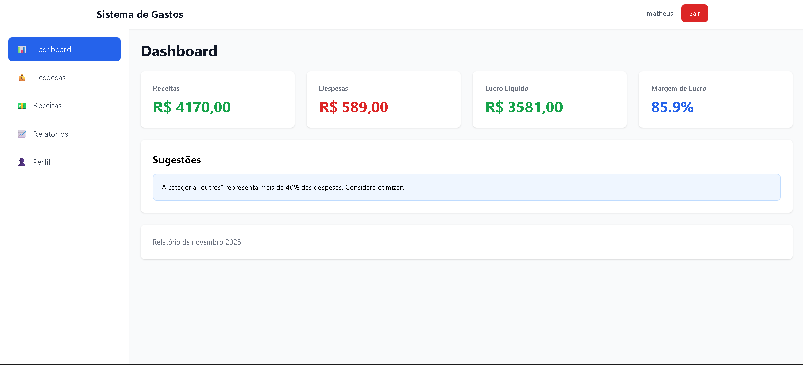
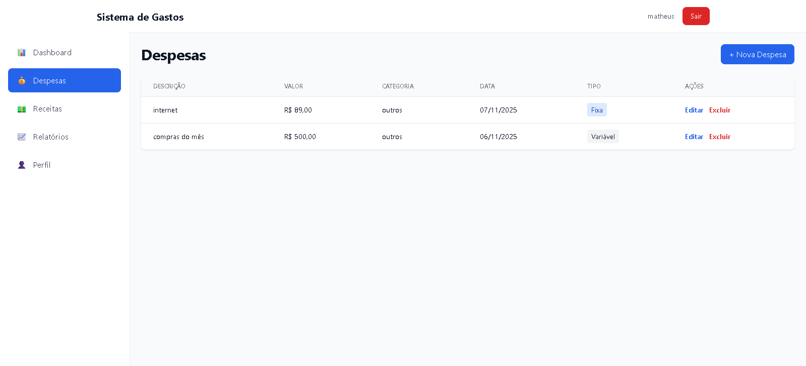
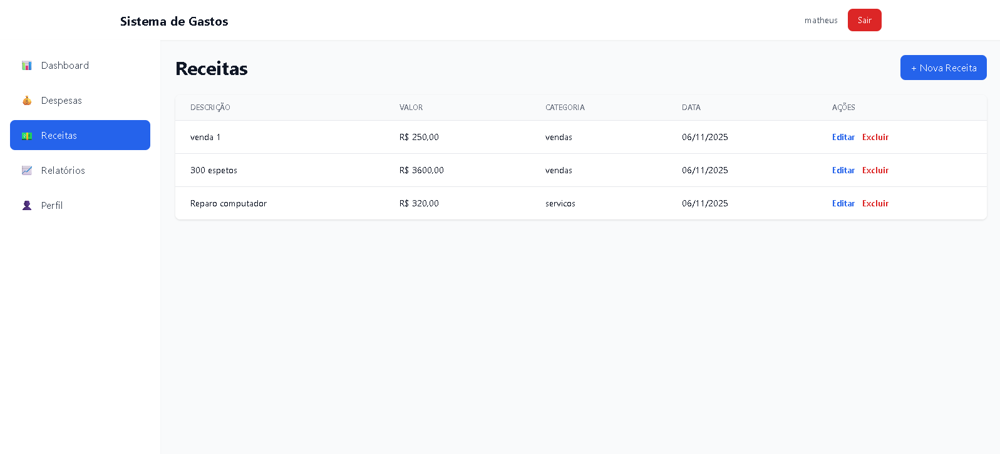
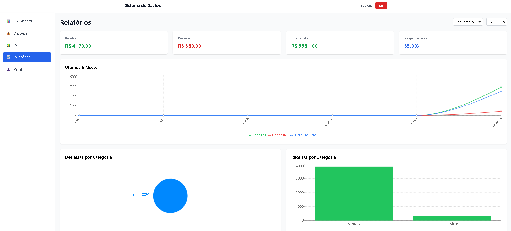

# Feedback

Anteriormente, enviamos o protótipo do projeto para o nosso  público-alvo testar, porém,
a mesma achou muito confusa e feia a interface da aplicação, por isso, decidimos alterar para uma versão mais moderna, que seja fácil de utilizar no dia a dia.
Após as mudanças, recebemos um feedback positivo com relação as mudanças.

# Ajustes
## Antes:

## Depois:

