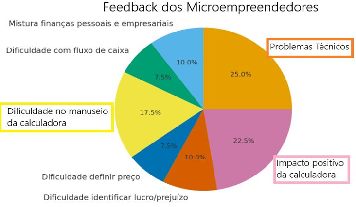

# Relatório
Realizamos uma coleta de feedbacks utilizando utilizando formulários que enviamos junto do projeto para outros micro-empreendedores que seguem o perfil do nosso público-alvo.

## Resultado dos fomulários:

## Conclusão:
Com base nos relatos coletados, concluímos que o projeto gerou um impacto positivo no cotidiano dos participantes. Além disso, os ajustes identificados permitirão aprimorar ainda mais a experiência de uso.